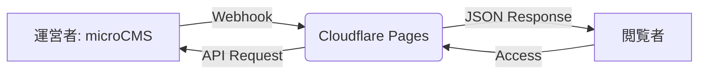

# アーキテクチャ設計

本ドキュメントでは、RFP（提案依頼書）に基づいた技術選定の根拠および、詳細な設計思想について記述します。

## システム構成（フロントエンド・デカップリング）

本プロジェクトでは、フロントエンドとコンテンツ管理（バックエンド）を完全に分離した**「ヘッドレス構成」**を採用しています。

- 配信元: Cloudflare Pages（静的ホスティング）
- コンテンツ提供: microCMS（API-based CMS）
- レンダリング: Client-side Rendering (CSR)

---

## 設計方針

本プロジェクトでは以下を重視しました：

- 低コスト
- 運用の容易さ
- 保守負担の最小化

そのため、サーバーサイドを持たない構成とし、
フロントエンドから直接APIを取得する設計としています。

---

## データモデリング（多言語設計）

多言語ニュースの管理において、**「1コンテンツ・マルチランゲージフィールド」**方式を採用しました。

### 選定理由
- **IDの一貫性**: 日本語・英語で同一のコンテンツIDを共有するため、詳細ページ間の言語切り替えロジック（idパラメータの引き継ぎ）が極めてシンプルになります。
- **アトミックな更新**: 1つの記事公開操作で両言語が同時に更新されるため、言語間での情報の乖離（出し忘れ）を構造的に防ぎます。

### 比較検討した代替案
- **言語別エンドポイント方式（非採用）**: news_ja, news_en とAPIを分ける手法。
- **却下理由**: 記事の紐付け管理（マッピングテーブル等）が別途必要になり、短期間開発において実装・運用コストが過剰になると判断しました。

---

## フロントエンドの設計方針

フレームワーク（React/Vue等）を導入せず、Vanilla JS + Gulp によるビルドパイプラインを選択しました。

- **オーバーヘッドの削減**: ニュース10件程度の小規模サイトにおいて、仮想DOMや複雑なライブラリは初期ロード速度を損なう要因となるため、軽量なVanilla JSを選択。
- **長期的な保守性**: 特定のフレームワークのバージョンアップに依存しないため、数年放置しても「壊れない」サイトを実現し、RFPの「保守負担の最小化」に応えています。

---

# セキュリティ詳細とリスク管理

## APIキーの運用設計
本プロジェクトでは、実装のシンプルさと開発スピードを優先し、`main.js` 内にAPIキーを記述しております。ブラウザ上でキーが露出することを前提に、以下の多層的な防御策を講じています。

### 1. 権限の最小化（Principle of Least Privilege）
使用しているAPIキーは、microCMSの管理画面にて**「取得（GET）」専用**として発行しています。
- **リスク低減:** 万が一キーが第三者に渡ったとしても、コンテンツの改ざん、削除、管理画面へのアクセスは物理的に不可能な設計です。
- **対象データの性質:** 公開を前提とした「ニュース記事」のみを対象としているため、情報漏洩によるビジネスインパクトを極小化しています。

### 2. リクエスト制限（Referer制限）
本番運用時には、microCMS側の設定により**「特定のドメイン（例：*.pages.dev または独自ドメイン）」からのリクエストのみを許可**する制限を推奨しています。
- これにより、キーをコピーして他のサイトやスクリプトから不正に利用（APIの無料枠の消費など）されるリスクを防止します。

---

## 検索エンジンへの配慮（noindex）
本サイトは試験用のデモ環境であるため、実在ブランドへの影響および重複コンテンツによるSEOへの悪影響を避けるべく、全ページに `noindex, nofollow` を設定し、検索エンジンのインデックスから明示的に除外しています。

---

## 今後の拡張ロードマップ

### 1. 独自ドメインの運用
現在は `pages.dev` のサブドメイン想定ですが、ブランド価値向上のため独自ドメイン（.com等）の適用を推奨します。Cloudflare上でドメイン管理を行うことで、ネームサーバー設定を含めた一元管理が可能です。

### 2. 静的サイトジェネレーター（Astro等）への移行
現在はCSR（クライアントサイドレンダリング）ですが、ページ数が増加した際は **Astro** への移行を提案します。
- **理由**: 現在の「HTML/SCSS/JS」という構成を活かしつつ、ビルド時にHTMLを生成するSSGへ移行することで、SEOと表示速度をさらに極大化できます。
